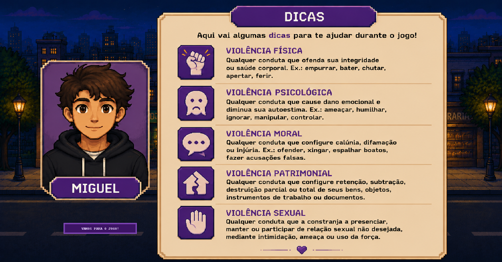
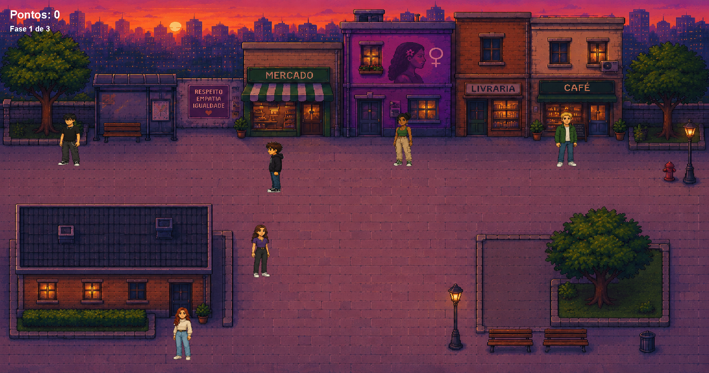
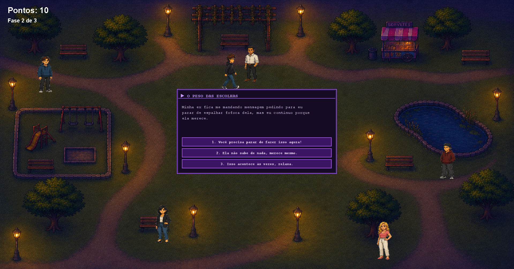
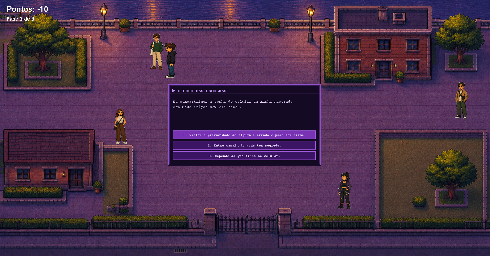

# 🎮 O Peso das Escolhas


[](https://github.com/JoaoGuiMarques/O-Peso-das-Escolhas/releases/latest)

Projeto desenvolvido para a disciplina de Projeto Aplicado II.

---

## 📖 Sobre

**O Peso das Escolhas** é um jogo educativo desenvolvido em Java com o objetivo de conscientizar sobre violência contra a mulher. O jogador explora três mapas diferentes, interage com personagens e responde perguntas sobre situações reais de violência de gênero.


---

## ✨ Funcionalidades

- 🎮 Movimentação em 4 direções com animação de sprite
- 💬 Sistema de diálogos personalizado com estilo pixel art
- 👥 Interação com 15 NPCs distribuídos em 3 mapas
- 🗺️ 3 mapas exploráveis com transição automática entre fases
- 🚧 Sistema de colisão com obstáculos por mapa
- ⚖️ Sistema de escolhas com pontuação e feedback final

---

## 🛠️ Tecnologias

- Java 17+
- Java Swing (interface gráfica e renderização)
- IntelliJ IDEA (ambiente de desenvolvimento)
- Git (controle de versão)
- GitHub (hospedagem do repositório)

---

## 🚀 Como executar

1. Clone o repositório:

```bash
git clone https://github.com/JoaoGuiMarques/O-Peso-das-Escolhas.git
```

2. Abra o projeto no IntelliJ IDEA.

3. Execute a classe `Main.java`.

---

## 📚 Objetivo educativo

O jogo aborda situações cotidianas de violência contra a mulher — como manipulação emocional, assédio, controle e agressão física — incentivando o jogador a refletir sobre suas atitudes e a importância de denunciar e apoiar vítimas.

---

## 👨‍💻 Desenvolvido por

- Felipe Gabriel Almeida Alves
- João Guilherme Marques
- Marcos Rafael Ferreira Bandeira 

## 📸 Galeria de Imagens

### 🎬 Apresentação do jogo


---

### 💡 Tela de dicas



---

### 🗺️ Mapa 1



---

### 💬 Interação com NPC - Mapa 2



---

### 💬 Interação com NPC - Mapa 3


